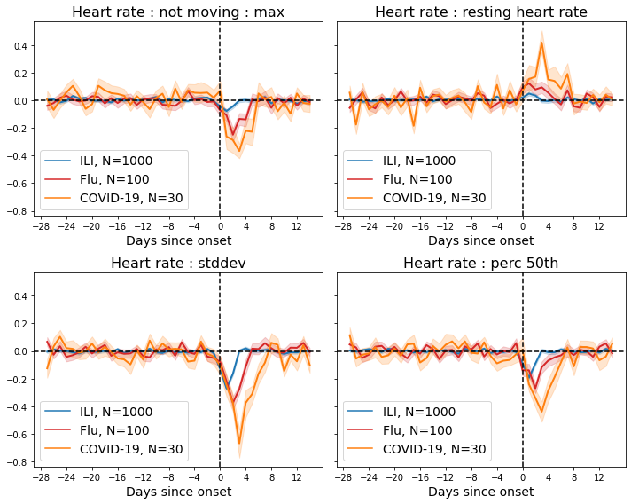
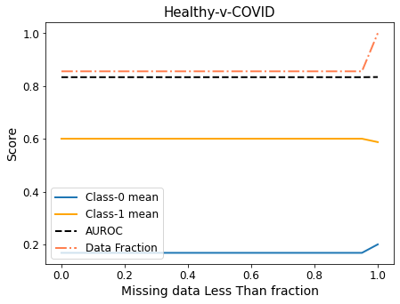
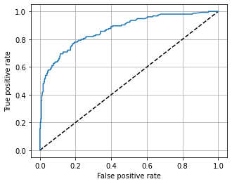

# NIH COMmunity: COVID-19 Ongoing Monitoring - Phase 1

[NIH-supported](https://www.nih.gov/news-events/news-releases/nih-awards-contracts-develop-innovative-digital-health-technologies-covid-19) effort to rapidly integrate data from multiple sources, including surveys and wearable sensors, to identify individuals who may have undiagnosed COVID-19.

This repository provides ML models for detecting the onset of COVID-19-like symptoms from wearable data and a survey data-based model with the potential to differentiate flu-like symptoms from COVID-19.

### Content

1. _Installation_ - see package [requirements](./requirements.txt) (install via `pip` or `conda`)

2. See [example notebook](./0__example_notebook.ipynb) which includes a walk-through of training and evaluating a COVID-19 onset detection model using synthetic data
    * Invokes functions from [utils.py](./utils.py)

3. Trained [wearable model](./trained_models/wearable_model.json) for reapplication to new datasets -- this can be subsituted in the example notebook above and reapplied to actual data

### Example

* **Synthetic data** is used to illustrate the model training and evaluation pipeline. Using the [default generation function and parameters](https://github.com/evidation-opensource/nih-community/blob/219f2d50b174edb31896f212a1d15287519e3b89/utils.py#L40) provided, discriminating signal around an Influenza-like Illness (**ILI** e.g. `Flu` or `COVID-19`) event onset can be seen in the normalized heart-rate derived features.



* An `XGBoost` model with these 4 features and 5 days on lagging data is trained to disciminate between Healthy (`Class-0`) and COVID-19 (`Class-1`) days. Missing data is also handled by the model (potentially _informative missingness_) and performance decay (towards the end of the x-axis) with all-missing inputs can be seen.



* Validation AUROC is used to select a model after [hyperparameter tuning](https://github.com/evidation-opensource/nih-community/blob/219f2d50b174edb31896f212a1d15287519e3b89/utils.py#L170) and a threshold (for prediction of COVID-19 events) is selected based on a `95% specificify` cut-off 

```
95% Specificity cutoff = 0.8778
              precision    recall  f1-score   support

           0       0.85      0.95      0.90       385
           1       0.83      0.57      0.68       154

    accuracy                           0.84       539
   macro avg       0.84      0.76      0.79       539
weighted avg       0.84      0.84      0.83       539
```



* **Cumulative recall** of individual participants around event onset is used to evaluate performance of the COVID-19 detection model. However, a model trained without explicitly accounting for other ILI events is suseptible to confusing non-COVID-19 ILI events (red and blue lines in plot below) as COVID-19 (orange line)


